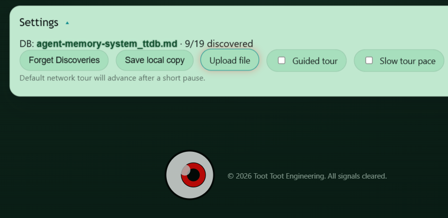

# Toot Toot Engineering
free, open-source software. [MIT License](LICENSE) | [antfriend.github.io](https://antfriend.github.io/)


# Universal Agent Memory & Learning System
## Multi Agent Memory, Learning, Reasoning and Coordination on *Any* Substrate

It's a synthetic, experimentally unified field with concrete elements of:
- free energy principle.
- subjective data, the Umwelt.
- experiential perception as synthetic modeling or maybe synthetic perception as experiential modeling, depending on your umwelt valence.
- free open source, just use it.

## Where to start:

- [agent-memory-system_ttdb.md](agent-memory-system_ttdb.md) — the semantically compressed spec file for all of this. It is also *an instance of the thing it specifies*: **a conforming store describing itself in its own format.** If you read one file, read this one.

- [feelings_ttdb.md](feelings_ttdb.md) — a second conforming store, and the one to load if you want to *see* what a knowledge globe is rather than read about it. An affective landscape: latitude is valence (north positive, south negative), longitude is what the feeling points at (east toward others, west toward the self), and distance from the origin is intensity. Serenity sits near the middle; Rage and Ecstasy sit at the edges, opposite each other. Walk it in the viewer below.

- [RFCs/](RFCs/) — the Request For Comment, internet spec style documents: the fully expanded version of agent-memory-system_ttdb.md. Start at [RFCs/INDEX.md](RFCs/INDEX.md).

- [research/valence/](research/valence/) — **not spec, and deliberately so.** An
open line of work asking whether a signed scalar field over a store's typed edges
locates its contradictions. It survived its first falsification round — the field
recovers held-out valence at r = +0.941 against published human norms — and has
not earned an RFC, because the test that would settle whether it earns its keep
has not run. Read `TIER1_RESULTS.md` for the results including the several places
the method or its author was wrong.

- [https://antfriend.github.io](https://antfriend.github.io) — the reference viewer. 

Upload any conforming TTDB store on it (including the spec file above) and walk the globe of records. This website is all static files, hosted on github. File "upload" is merely to a client-side cookie on your own machine.


The load-bearing idea, in one breath: an agent's memory is one plain-text file
of coordinate-addressed records with typed edges and epistemic weights; the
file IS the model, and the runtime — firmware or LLM — is a generic interpreter
given identity by the file. `EPS = sal × (255 − conf) / 255` tells the agent
what it relies on but hasn't verified, which is where to look next. Everything
below is that idea wearing different hats.

## What do you want to make?

Each recipe names the conformance profile it needs. **Profile 1 (Lone Brain)**
is one agent, one store. **Profile 3 (Team Brain)** is Profile 1 plus the
network rules. They're defined in
[TTN-RFC-0003](RFCs/TTN-RFC-0003-Reference-Implementation.md) and restated
compactly at `@LAT50LON1` / `@LAT50LON3` in the spec store.

### "I want to replicate this experiment as exactly as possible."

**SOLUTION:** Copy or fork
[https://github.com/antfriend/robot_team](https://github.com/antfriend/robot_team),
assemble the hardware, flash. The fleet is three Heltec WiFi
LoRa 32 V4s, a LilyGo T-Deck, and an M5Stack Cardputer ADV, coordinated by a
laptop running `orchestrator/companion.py`. The repo's `CLAUDE.md` documents the
build path (arduino-cli, not PlatformIO) and every hardware gotcha we hit so you
don't have to. The primary hypothesis under test is *semantic positioning:*
inferring where nodes are from what they perceive in common.

The nodes are deliberately **not** the same as each other — the Cardputer brings
a microphone and an IMU that nothing else on the mesh has, the V4s bring
long-haul radio, the T-Deck brings GNSS. That heterogeneity is not incidental;
[TTDB-RFC-0009](RFCs/TTDB-RFC-0009-Counter-Story-and-Narrative-Morphospace.md)
argues it is the only thing that makes the collection able to know something no
member could.

### "I want a minimal, single-agent memory system to be the librarian for a large sprawling project of many folders and files. I'd appreciate hand-holding, I don't understand this thing at all."

**SOLUTION:** You want a Profile 1 Lone Brain, no hardware, no network. Five
steps:

1. Copy [agent-memory-system_ttdb.md](agent-memory-system_ttdb.md) and the
   [RFCs/](RFCs/) folder into your project so your agent (and you) can read
   the rules.
2. Create `librarian.ttdb.md` in your project root. Copy the ` ```mmpdb ` header
   block from the spec file and change the umwelt: role `librarian`,
   perspective "the memory of this repository", and a coordinate mapping that
   fits your terrain — e.g. `lat` = area of the project (docs, build system,
   core code, deploy, lore), `lon` = item within the area.
3. Add one record per thing worth remembering: where a subsystem lives, why a
   decision was made, which docs are stale. Give each record `[ew]` weights —
   `conf` for how much you trust it, `sal` for how often it gets used — and
   typed edges (`depends_on`, `revises`, `supports`) to related records.
4. Tell your LLM assistant (in `CLAUDE.md` or equivalent) to open
   `librarian.ttdb.md` at the start of each session, *retrieve* records rather
   than stuffing the whole file into context, and append new records instead of
   editing old ones (a changed understanding is a new record with a `revises`
   edge).
5. When the assistant wonders what to check, it computes EPS across the store:
   the highest-EPS record is the load-bearing thing nobody has verified. That's
   the librarian earning its keep.

The Profile 1 checklist at `@LAT50LON1` is the whole spec for this use case —
ten clauses, one afternoon.

### "I want my LLM agent to have persistent memory that actually learns, not a scratchpad."

**SOLUTION:** Profile 1 again, but run the loop: every action the agent takes
carries an *expectation* (a predicted outcome), outcomes are appended to a side
log, and a reconciliation pass folds them into the weights asymmetrically —
expectation met: `conf +2`; violated: `conf −16`, `sal +8`. Knowledge that
works goes quiet; knowledge that fails gets loud. This is "Learning from
Action" (`@LAT20LON3`), the spec's own highest-EPS record. One agent now runs
the outer loop; **the asymmetry itself is still unimplemented everywhere** — see
the last section of this README.

### "I want a sensor mesh in my garden / on my roof / across my neighborhood that shares what it learns."

**SOLUTION:** Profile 3 on ESP32s. Each node carries its own TTDB of local
observations (soil moisture transitions, sunrise temperatures, which BSSID
neighbors it can hear), consolidates them into beliefs offline, and pushes
beliefs — not raw data — to its peers over ESP-NOW in-range or LoRa long-haul.
The firmware in this repo is your reference: `Toot` (signed frames),
`TtdbShare` (store-over-network), `LinkPercept`/`EntityPercept` (evidence
layers). The network invariants that survived real hardware are in
[TTN-RFC-0007](RFCs/TTN-RFC-0007-Reliable-Delivery.md) through
[0009](RFCs/TTN-RFC-0009-TTDB-Push-Back.md); offline-first is the foundation,
not a degraded mode, so a node that loses the mesh is still a complete agent.

### "I want synchronized music / light from a swarm of cheap microcontrollers, no conductor cable, no NTP (Network Time Protocol)."

**SOLUTION:** [TTN-RFC-0010 Fleet Pulse](RFCs/TTN-RFC-0010-Fleet-Pulse.md).
Nodes elect a pulse clock (first-up conducts, joiners never coup), broadcast
only the time-base parameters, and every node computes the beat locally — zero
per-beat traffic, and the residual ±50 ms skew is reframed as musical *swing*.
This repo's fleet plays 120 BPM duets over it. Works for stage rigs, bike
swarms, and any art installation where the point is that **nobody is in charge.**

### "I want to do positioning without GPS — the actual science."

**SOLUTION:** This is the primary hypothesis and it is *open*. Semantic
positioning ([TTN-RFC-0011](RFCs/TTN-RFC-0011-Semantic-Positioning.md)) claims
position is recoverable from umwelt overlap: nodes that perceive the same
things are near each other, and a confidence-weighted overlap measure Ω plus a
spring-relaxation embedding recovers the fleet's shape — one GPS anchor pins it
to Earth. Our field results so far: amplitude ranging (RSSI, BLE) is
shadowing-limited outdoors, which is exactly why the multi-tier evidence
approach exists. Replications, refutations, and new evidence tiers (TDoA, ToF,
entity overlap) are all genuinely wanted.

### "I want a shared world-bible for my D&D campaign / collaborative fiction that survives contradiction."

**SOLUTION:** A Profile 1 store per author, Profile 3 belief exchange between
them. The machinery maps directly: canon is a belief with a confidence;
independent authors arriving at compatible lore merge with a confidence bonus
(agreement across observers is evidence); contradictions are *flagged, never
suppressed* — a much-cited but contradicted piece of canon demotes to an
explicit open question instead of being silently retconned. Every assertion
carries provenance, so you always know which GM said what, when.

### "I want a zettelkasten that tells me which of my notes to distrust."

**SOLUTION:** Profile 1, and honestly the smallest on-ramp here. Your notes
become records with coordinates and typed edges — so far, ordinary
zettelkasten. The addition is the `[ew]` block: `conf` for how settled each
idea is, `sal` decaying with disuse, and EPS surfacing the note you cite
constantly but never actually verified. Load the file in the
[reference viewer](https://antfriend.github.io) and your slip-box is a globe
you can walk. ([TTDB-RFC-0005](RFCs/TTDB-RFC-0005-Epistemic-Weight.md) is the
two-page spec.)

### "I want off-grid, disaster-tolerant text messaging that sends meaning, not bytes."

**SOLUTION:** The TTN mesh rules were written for exactly this posture:
offline-first, partition-tolerant, local data sovereignty, emergencies preempt
everything. On thin LoRa links you compress meaning to context-free tokens
with deterministic expansion at the receiving edge
([TTN-RFC-0004](RFCs/TTN-RFC-0004-Semantic-Compression.md),
[0006](RFCs/TTN-RFC-0006-LoRa-Packet-Framing.md)). Trust is local and
subjective, computed from observed behavior — there is no global reputation
score to capture, and no autonomous AI speech on the shared medium.

### "I want a game-playing agent that knows when its plan has stopped working."

**SOLUTION:** [ARC-RFC-0001](RFCs/ARC-RFC-0001-Dynamics-Solver-Architecture.md),
built for the ARC Prize: a count-based explorer floor with a recognition-gated
solver layered on top. Every solver step re-derives its expectation from the
current state; K consecutive expectation failures abort the plan back to
baseline exploration, because plans are hypotheses and failing hypotheses lose
control. This is the nearest formal expansion of Learning from Action, which
brings us to —

## The open invitation

The spec store's own attention mechanism, run on itself, points at one record:
`@LAT20LON3`, **Learning from Action** — the newest, least-proven,
most-relied-upon idea in the system. The `+2/−16`
asymmetry and the `K = 3` abort threshold are hypotheses awaiting a real run,
on an ESP32 acting on sensor expectations or an LLM harness acting on
predicted tool results.
[TTDB-RFC-0009](RFCs/TTDB-RFC-0009-Counter-Story-and-Narrative-Morphospace.md)
is the nearest thing to a designed collision with this gap: its experiment needs
the store to *choose a repair path, commit to it, and decide to stop* — three
actions it has no way to learn from — and it asks you to log where you got
blocked rather than route around it, because the location of the block is the
measurement. Run it, append the outcome records, reconcile the
weights, push the belief back. The moment the first outcome record moves that
record's confidence, this document stops *describing* the learning system and
starts *performing* it — and whoever runs the experiment becomes its
co-author, with provenance to prove it. (`@LAT98LON2` in
[the spec store](agent-memory-system_ttdb.md) is the formal version of this
paragraph.)

### Where it stands, 2026-08-01: partly answered, and the interesting half is open

[LOCUS](https://antfriend.github.io/companion_arcprize.md), an ARC-AGI-3
competition agent, *is* the LLM harness described above, and it has been running
the loop for 39 sessions: 246 records, 18 of them revised, one 28 times, with
confidence gated on outcome — "conf rises only when Phase 4 validates." That
corroborates the first rule, that expectation-bearing action earns confidence.

It does **not** test the part that needed testing. There is no `+2/−16`
asymmetry; confidence moves in large manual jumps. There is no `K`-consecutive
abort. And outcomes overwrite records rather than appending to a side log, so the
loop mutates where the spec says it should testify. The constants are exactly as
unrun as they were.

Reading that agent moved two records here, in opposite directions, under this
store's own rule: `@LAT20LON3` up `+2` for the rule that held, and `@LAT98LON2` —
which had claimed the idea was implemented nowhere — down `−16` with `sal +8` for
the claim that failed. Knowledge that works went quiet; knowledge that failed got
loud. The asymmetry operating on the store's own beliefs, driven by evidence from
outside it.

But **a human did the reconciling.** No store reconciled itself, and that is the
whole of what `@LAT20LON3` describes. The sharper finding is `@LAT98LON6`: the
`@PERCEPT:before → @PERCEPT:after` transition form that all of this is specified
on is instantiated **zero times anywhere** — including by the agent whose own
constraints mandate it. A loop that overwrites state never materializes the
difference, and the difference is the datum.

So the invitation narrows rather than closes. The harness exists; the
reconciliation is still manual; the constants are still guesses. What is now
missing is precise enough to build: one loop that writes the difference down.
